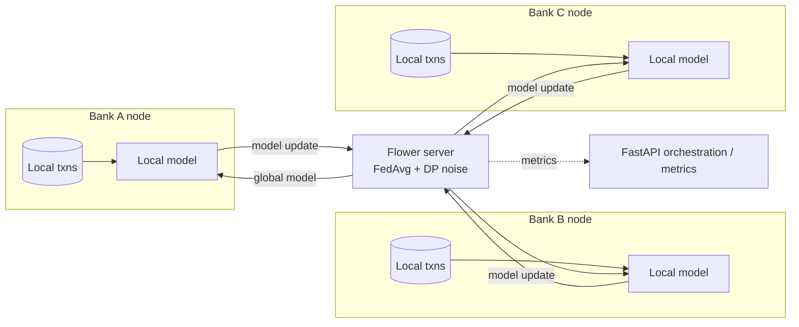

# Federated AML Network

> Money-laundering rings span multiple banks — but no single bank can see the whole pattern, and privacy law (GDPR, banking secrecy, FinCEN) forbids pooling raw transaction data. **Federated AML Network lets banks catch what they can't see alone:** they collaboratively train a shared fraud/AML model without any bank exposing its raw data, and differential privacy bounds what the trained model itself can leak about any individual.
>
> *Under the hood: Flower + FedAvg across isolated bank nodes, Opacus differential privacy with an explicit ε budget, demonstrated by an attack that succeeds without DP and fails with it.*

**For:** bank financial-crime / data-science teams — a consortium tool whose value grows with each bank that joins.
**Skill signal:** Distributed machine learning · privacy-preserving computation · regulatory-aware engineering
**Region anchor:** EU (GDPR) + US (FinCEN / Bank Secrecy Act)

[](https://github.com/jzwerg/federated-aml-network/actions/workflows/ci.yml)

---

## Why this exists

Banks cannot pool raw customer transactions — GDPR, banking secrecy, and FinCEN constraints forbid it. Yet money-laundering typologies (structuring, layering, mule networks) are inherently *cross-institutional*: the signal is strongest precisely in the data no single bank can see. Federated learning resolves the tension: each bank trains locally, only model updates are shared, and differential privacy bounds what those updates can leak.

## Architecture



Raw data never leaves a node. Only clipped, noised model updates cross the boundary.

## Stack

- **Python** · **Flower** (federated learning framework) · **PyTorch** (tabular fraud classifier)
- **Opacus** for differential privacy (gradient clipping + Gaussian noise)
- **FastAPI** for orchestration and metrics
- **Docker Compose** — 1 server + 3 isolated bank nodes

## What makes it stand out

- **Non-IID data** across banks (each bank sees a different fraud distribution) — realistic, and harder than the usual toy demo.
- **Attack/defense demo:** a membership-inference attack that *succeeds* against a vanilla federated model and *fails* once differential privacy is enabled, with the privacy budget (ε) made explicit.

See [`docs/product/brief.md`](./docs/product/brief.md) for the product thinking (users, success metrics, non-goals, risks), [`PLAN.md`](./PLAN.md) for the full build plan, and [`docs/adr/`](./docs/adr/) for engineering decisions.

## Run it

```bash
docker compose up        # Flower server + 3 isolated bank nodes  (or: make up)
make benchmark           # collaboration lift: federated AUC vs. each bank's solo model
```

This is a simulation you run, not a site you visit — and the proof is in CI. Every push runs the attack demo in GitHub Actions: a membership-inference attack **succeeds against the vanilla model and fails once differential privacy is enabled**, with the ε budget reported. A green check means the privacy guarantee is real, not claimed.

> 🎬 *A terminal recording of the attack/defense demo will live here.*

## Status

🚧 Early implementation. **Done:** the stack boots a federated FedAvg round across three isolated bank nodes (metrics on `:8200`), and a non-IID synthetic generator with injected fraud typologies (structuring, layering, cross-bank mule rings) shows the federated model beating every bank's solo model — `make benchmark`. **Next:** the differential-privacy layer and the membership-inference attack/defense demo. See [`ROADMAP.md`](./ROADMAP.md).
