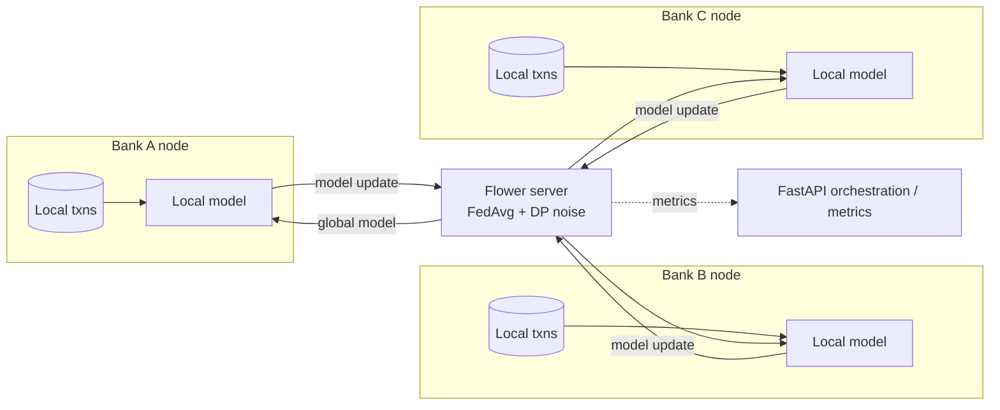

# Federated AML Network

> Multiple banks collaboratively train a shared anti-money-laundering / fraud model **without any bank exposing its raw transaction data** — and with differential privacy applied so the *trained model itself* cannot be used to reverse-engineer an individual's data.

**Skill signal:** Distributed machine learning · privacy-preserving computation · regulatory-aware engineering
**Region anchor:** EU (GDPR) + US (FinCEN / Bank Secrecy Act)

---

## Why this exists

Banks cannot pool raw customer transactions — GDPR, banking secrecy, and FinCEN constraints forbid it. Yet money-laundering typologies (structuring, layering, mule networks) are inherently *cross-institutional*: the signal is strongest precisely in the data no single bank can see. Federated learning resolves the tension: each bank trains locally, only model updates are shared, and differential privacy bounds what those updates can leak.

## Architecture

Raw data never leaves a node. Only clipped, noised model updates cross the boundary.

## Stack

- **Python** · **Flower** (federated learning framework) · **PyTorch** (tabular fraud classifier)
- **Opacus** for differential privacy (gradient clipping + Gaussian noise)
- **FastAPI** for orchestration and metrics
- **Docker Compose** — 1 server + 3 isolated bank nodes

## What makes it stand out

- **Non-IID data** across banks (each bank sees a different fraud distribution) — realistic, and harder than the usual toy demo.
- **Attack/defense demo:** a membership-inference attack that *succeeds* against a vanilla federated model and *fails* once differential privacy is enabled, with the privacy budget (ε) made explicit.

See [`PLAN.md`](./PLAN.md) for the full build plan and [`docs/adr/`](./docs/adr/) for engineering decisions.

## Status

📋 Planning phase — specification and build plan committed. Implementation to follow.
